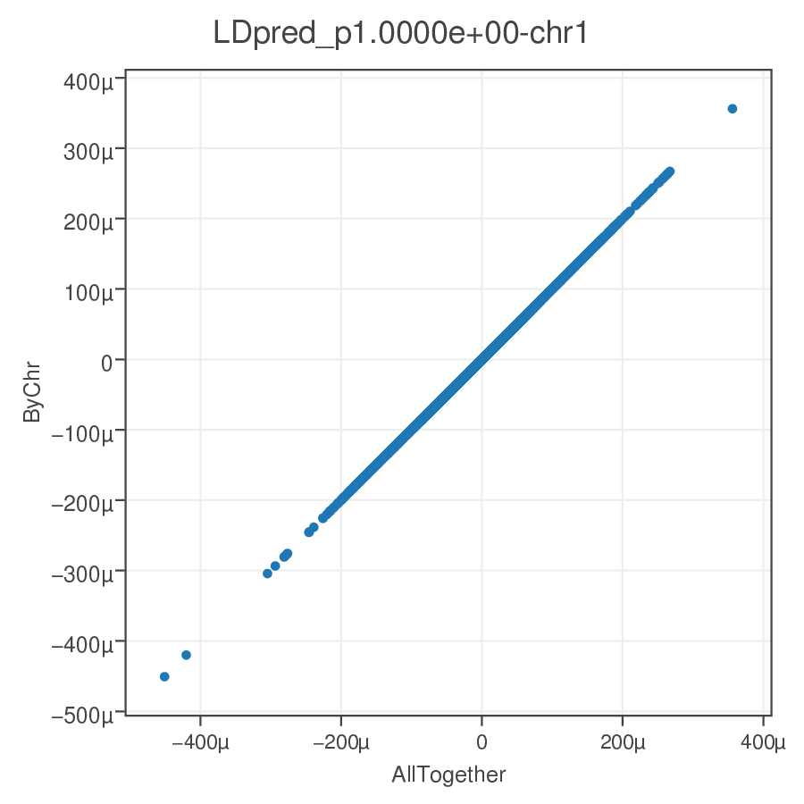

## Run LDpred chromosome by chromosome

=======================

### **** Optimized LDpred version for memory efficiency and parallel in chr by chr ****


*This is an ad hoc modification of the source code of the original LDpred code to make it can be run in parallel chr by chr. Full credit and copyright should be granted to the LDpred author. If there's violation of the copyright of LDpred, please let me know, I will delete all these codes and tutorials.*

```
THE SOFTWARE IS PROVIDED "AS IS", WITHOUT WARRANTY OF ANY KIND,
EXPRESS OR IMPLIED, INCLUDING BUT NOT LIMITED TO THE WARRANTIES
OF MERCHANTABILITY, FITNESS FOR A PARTICULAR PURPOSE AND NONINFRINGEMENT.
IN NO EVENT SHALL THE AUTHORS OR COPYRIGHT HOLDERS BE LIABLE FOR ANY CLAIM,
DAMAGES OR OTHER LIABILITY, WHETHER IN AN ACTION OF CONTRACT, TORT OR OTHERWISE,
ARISING FROM, OUT OF OR IN CONNECTION WITH THE SOFTWARE
OR THE USE OR OTHER DEALINGS IN THE SOFTWARE.
```

### Philosophy
This is trying to have a minimal twist of the LDpred code to make it can be run in parallel chromosome by chromosome. This is neither a guarantee of a cleaning code nor a full structured or a full documented of the modification of the code. However, I will try my best to have benchmarks with original LDpred software to try my best to guarantee the results are accuracy. If you found any bug related to the discrepancy of this pipeline with original LDpred, please let me know. I am happy to fix that.

For the original LDpred, it actually runs LD structure estimation and the effect size reweighing step chr by chr, but for the later reweighing step, it needs the global estimation of genome-wide heritability and inflation factor.__In this pipeline, we split these processes as two steps: 1) Estimate LD structure chr by chr, and also gather the parameters for estimating of genome-wide heritability and inflation factor. 2) Estimate genome-wide heritability and inflation factor(this is very cheap), and put this parameter for reweighing beta values chr by chr.__ By this way, we can parallel the computing chr by chr, which will dramatically reduce the memory load and the waiting time. But before we run step 2, __We have to wait all the computing is done in step 1__, as we need the information from all chrs to have a global estimation of genome-wide heritability and inflation factor

#### Install the LDpred software
Please just download this git repository to the any folder you want. For example, I put it here: ```/medpop/esp2/wallace/tools/LDpred/1.0_wallace/```, it's better you can refer this into your Linux ```$PATH``` parameter. Then you can just use ```LDpred.py``` anywhere you want. I did this.

This version depends on ```plinkio``` and ```hickle```. Please install by ```pip install hickle plinkio docopt```. I also recommend use [conda](https://conda.io/en/latest/).

__This repo is base on the Feb272019 version of LDpred, with proper bug fix.__

- This version run in chr by chr mode, and thanks to [hickle](https://github.com/telegraphic/hickle) which greatly reduced the amount of memory needed.
- Parallel in chr, saved your waiting time.
- Fix the bug for loading GWAS summary if there are snps with extreme pvalues (0 or 1).
- Fix the bug for loading GWAS summary with SNP specific sample size.


### Start run LDpred chr by chr
#### 1) Coordinate the LD reference panel and summary statistics.
The LD reference panel is in plink bed/fam/bim format, the input summary statistics format please refer LDpred instruction. Please make sure the snp id is consistent between LD reference panel with the summary statistics. __Please split the LD reference panel and summary statistics chr by chr, we will parallel them starting from here.__

```bash
# parallel is GUN parallel program [https://www.gnu.org/software/parallel/].
# wecho is a my python script in this repository, which depends on docopt for parse args,
# just reformat the command line, skip comments and generate a single line.
# You can use bash for-loop to replace my style here.

parallel -j 1 -q wecho "
    rm -f data/coord.file.chr{}
    &&
    /medpop/esp2/wallace/tools/LDpred/1.0_wallace/LDpred.py --debug coord
        # LD ref. file.
        --gf data/ldref.chr{}
        --ssf data/refined.summary.chr{}.txt
        --ssf-format=CUSTOM
        --out data/coord.file.chr{}
        --rs MarkerName --A1 Allele1 --A2 Allele2 --pos pos --chr hg19chrc --pval p --eff Beta --ncol N
        # reffreq is also the A1 freq.
        --reffreq Freq.Allele1
        --beta
    &>log/1-3.chr{}.log
" :::: chr.sh

#------input example------------
# please make sure the SNP_ID is the same
head -n 3 data/ldref.chr20.bim
20      20:61098        0       61098   T       C
20      20:61270        0       61270   C       A
20      20:61795        0       61795   T       G

cat data/refined.summary.chr20.txt | head -n 4 | column -t
hg19chrc  pos    MarkerName  Allele1  Allele2  Freq.Allele1  Beta           SE            p       N
chr20     61098  20:61098    T        C        0.2241        -0.0014802402  0.0060535679  0.8068  1131035
chr20     61270  20:61270    A        C        0.9775        -0.0055336517  0.019517294   0.7768  1131035
chr20     61795  20:61795    T        G        0.3387        -0.0030965362  0.0052775117  0.5574  1131035
```

#### 2) Generate the LD structure file and summary for estimating of heritability and inflation factor.
```
 parallel -j 1 -q wecho "
 rm -f data/ld_file_chr{}.gz*
 &&
      /medpop/esp2/wallace/tools/LDpred/1.0_wallace/LDpred.py ldfile
         # coord file
         --cf data/coord.file.chr{}
         # num_of_snp/3000, corresponding 1m on each side of the focal snp.
         --ldr 700
         --ldf data/ld_file_chr{}.gz
     &>log/1-4.chr{}.log
 " :::: chr.sh
```

#### 3) Wait all chr done in step 2. Reweigh the beta value by LDpred.

```
parallel -j 1 -q wecho "
    /medpop/esp2/wallace/tools/LDpred/1.0_wallace/LDpred.py
        gibbs
        --cf data/coord.file.chr{1}
        # sample size for summary statistics.
        --N 235705
        # num_of_snp/3000, corresponding 1m on each side of the focal snp.
        --ldr 700
        --ldf data/ld_file_chr{1}.gz
        --out data/BMI2.ldpred.radius700.chr{1}-gibbs
        &>log/1-5.chr{1}-gibbs.log

        &&
        gzip -f data/BMI2.ldpred.radius700.chr{1}-gibbs*
" :::: chr.sh
```
__It's the user's responsibility to make sure all the cached files for the heritability and inflation factor estimation are fully loaded, please check the log information from the last step to confirm it.__ You will find some thing like below.
```
WALLACE INFO: load chromosome level summary file: /medpop/esp2/wallace/projects/Amit/PRS/BMI_Mark/LDpred_CHR_V1.0_Feb272019_HKL/data/ld_file_chr1.gz_ldradius700.pickled.gz_byFileCache.txt
WALLACE INFO: load chromosome level summary file: /medpop/esp2/wallace/projects/Amit/PRS/BMI_Mark/LDpred_CHR_V1.0_Feb272019_HKL/data/ld_file_chr2.gz_ldradius700.pickled.gz_byFileCache.txt
WALLACE INFO: load chromosome level summary file: /medpop/esp2/wallace/projects/Amit/PRS/BMI_Mark/LDpred_CHR_V1.0_Feb272019_HKL/data/ld_file_chr3.gz_ldradius700.pickled.gz_byFileCache.txt
.......
WALLACE INFO: load chromosome level summary file: /medpop/esp2/wallace/projects/Amit/PRS/BMI_Mark/LDpred_CHR_V1.0_Feb272019_HKL/data/ld_file_chr20.gz_ldradius700.pickled.gz_byFileCache.txt
WALLACE INFO: load chromosome level summary file: /medpop/esp2/wallace/projects/Amit/PRS/BMI_Mark/LDpred_CHR_V1.0_Feb272019_HKL/data/ld_file_chr21.gz_ldradius700.pickled.gz_byFileCache.txt
WALLACE INFO: load chromosome level summary file: /medpop/esp2/wallace/projects/Amit/PRS/BMI_Mark/LDpred_CHR_V1.0_Feb272019_HKL/data/ld_file_chr22.gz_ldradius700.pickled.gz_byFileCache.txt
WALLACE INFO: totally loaded chr: 22
```

#### 4) Combine all the reweighed file together.
#### 5) Score your samples by the reweighed beta value. I usually use plink.
```
# Validate data
# --score my.scores 3 2 1 [id,allele,score]
# reads variant IDs from column 3, allele codes from column 2, and scores from column 1.
source config.sh
parallel -j 1 -q wecho "
    plink
        --bfile data/all.chr
        --allow-no-sex
        --score <(zcat ${sum}{}.gz  | wcut -t 'sid,nt2,ldpred_beta' ) 1 2 3
        --out results/score.{}
    &&
    gzip -f results/score.{}.profile
" :::: lds.sh

# lds are the proportion of causal setting in LDpred.
cat lds.sh
LDpred-inf
LDpred_p1.0000e+00
LDpred_p1.0000e-01
LDpred_p1.0000e-02
LDpred_p1.0000e-03
LDpred_p3.0000e-01
LDpred_p3.0000e-02
LDpred_p3.0000e-03
```

### Bechmark of this pipeline with LDpred's load as a whole approach.
Please check the LDpred_p1.0000e+00-chr1.png and images/all.LDpred_p1.0000e+00.png, the results are identical.


